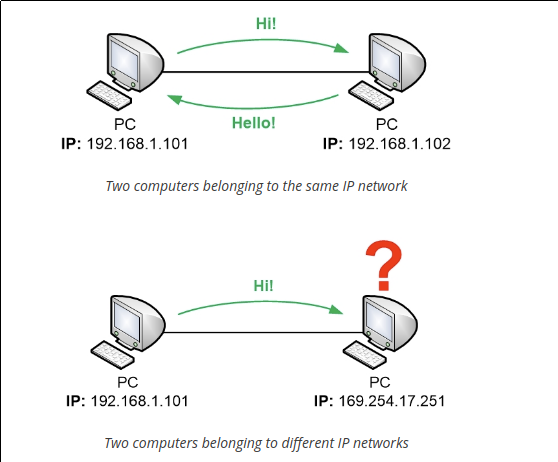

On a computer network, all devices that are connected to the same local network can talk directly with each other, as long as they have IP addresses that belong to the same IP network. If the computers belong to different IP networks then they have to communicate with each other via a router. The main purpose of a router is to be able to forward traffic to different destinations. Within computer networking, those destinations are different IP networks.

source: 
https://www.homenethowto.com/basics/ip-addresses/