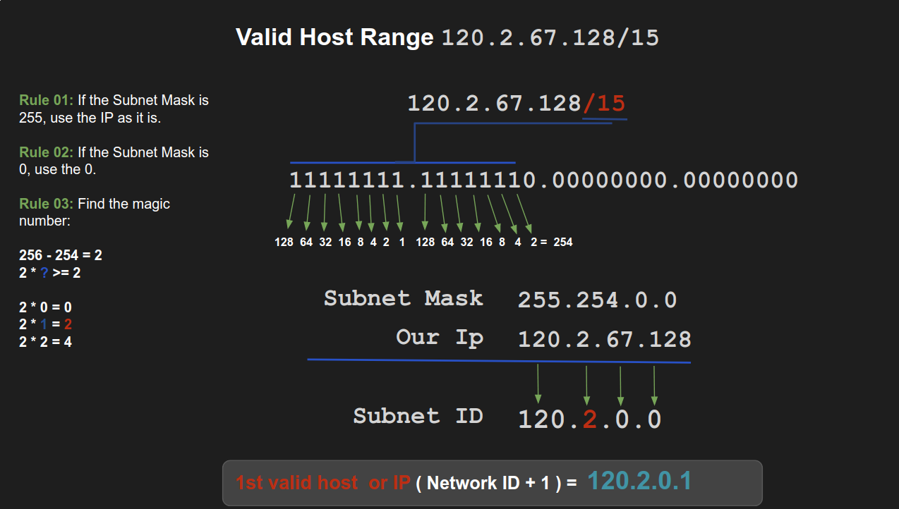
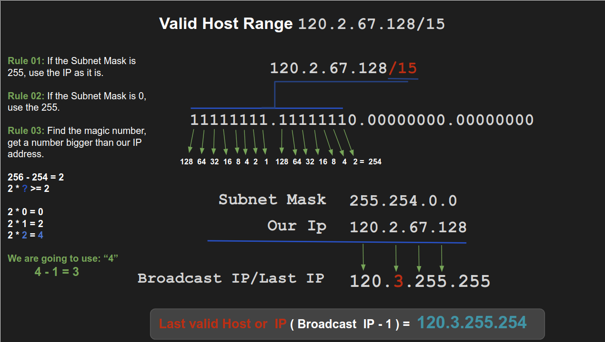

**¿Which of the following is the valid host range for the subnet on which the IP address 120.2.67.128/15 resides?**

First of all we need to convert our Subnet Mask in Binary Format. The quantity of **ones**, depends on what the **MASK** /15 indicates.
Calculating the range:

:pencil2: **Answer:**
**[ 120.2.0.1 - 120.3.255.254 ]**

:fireworks: **References:**
- [IP addresses](https://www.youtube.com/watch?v=uyRtYUg6bnw/)
- [Calculator](http://www.aboutmyip.com/AboutMyXApp/SubnetCalculator.jsp?ipAddress=120.2.67.128&cidr=15)