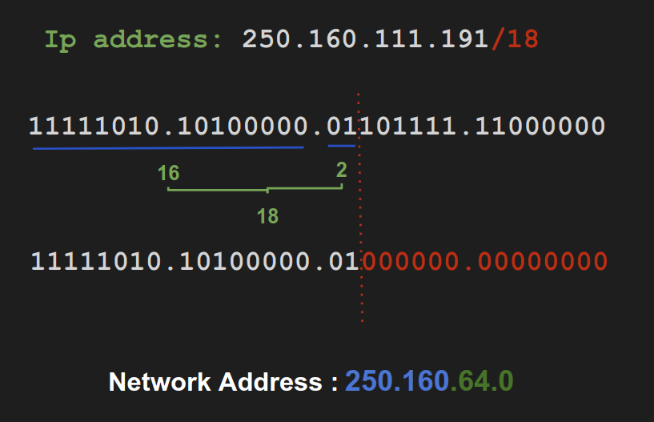

### What is the Network address of a host with an IP address of 250.160.111.191/18?

- 250.160.64.0
- 250.160.0.0
- 250.160.111.176
- 224.0.0.0
- 250.160.108.0
- 250.160.111.128

:pencil2: **Answer:**
**250.160.64.0**

:fireworks: **References:**

- [Calc](http://www.aboutmyip.com/AboutMyXApp/SubnetCalculator.jsp?ipAddress=120.2.67.128&cidr=15)
- [Calculate Network](https://www.youtube.com/watch?time_continue=72&v=hb2yTNT2rBU&feature=emb_logo)
