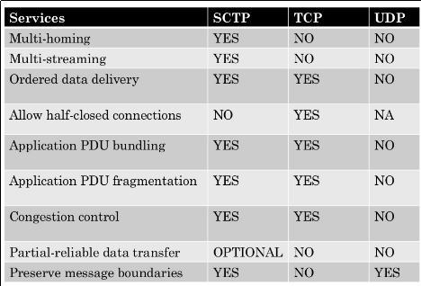

**Which of this is not true?**

- **UDP supports Broadcasting:**

UDP supports multcast, it is sutable for broadcast informaton such as in many kinds of service discovery and shared information such as Precision Time Protocol and Routing Information Protocol.

- **There is no sequencing of data in UDP. If ordering is requiered, it has to be managed by the application layer:**

UDP does not provide subsequent data to the application while it is requesting re-sending of the missing data.
- **UDP is a datagram-oriented protocol:**

With UDP, computer applications can send messages, in this case referred to as datagrams, to other hosts on an Internet Protocol (IP) network.

- **The delivery of data to the destination cannot be guaranteed in UDP:**

There is no guarantee of delivery, ordering, or duplicate protection.

- **UDP has only the basic error checking mechanism using checksums:**
UDP provides checksums for data integrity, and port numbers for addressing different functions at the source and destination of the datagram. 

- **UDP is comparatively slower than TCP**

:pencil2: **Answer:**
**UDP is comparatively ower than TCP is NOT TRUE**