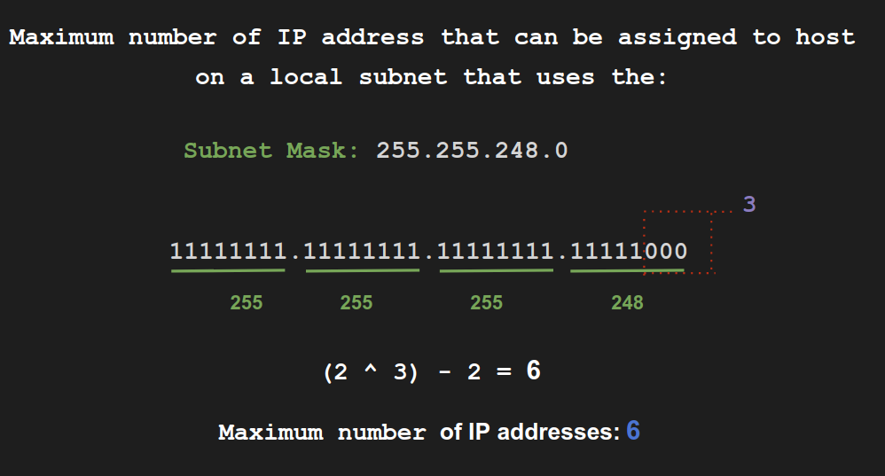
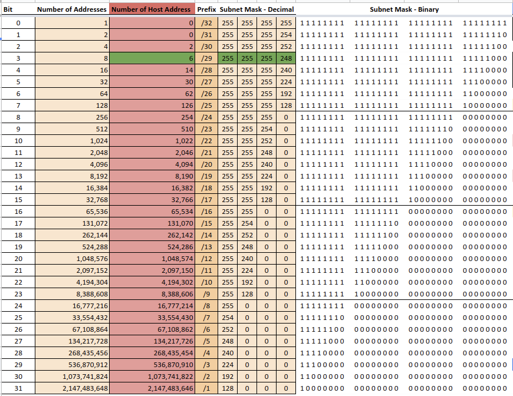

**What is the maximun number of IP addresses that can be assigned to host on a local subnet that uses the 255.255.255.248 subnet mask?**

 :pencil2: **Answer:**
**maximun number of IP addresses : 6**
