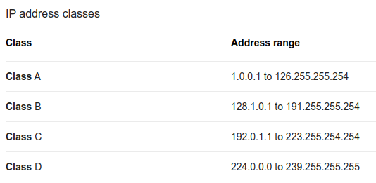

**Which of this is not a class of IP address?**

- Class D
- Class C
- Class E
- Class F

**IP:**

The IP (Internet Protocol) is the fundamental protocol for communications on the Internet.

**IP ADDRESS:**

An IP address is a number identifying of a computer or another device on the Internet.

Classes of IP addresses

 :pencil2: **Answer:**
**Class F  is not a class of IP address**