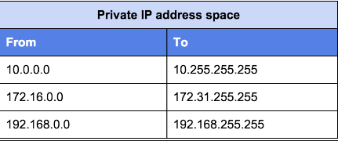

**Which of the following is private IP address?**

- 18.187.149.135
- 192.168.108.121
- 81.0.182.194
- 130.41.89.219

**What's a Private IP address?**

Home routers have their local address set to a default, private IP address number. 

That's the point: Your private address is just for your router, your network and you.
The private address ranges in a network don't have to be synchronized with the rest of the world and Internet.

 :pencil2: **Answer:**
**192.168.108.121  is private IP address.**
