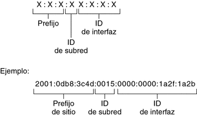

**How long is an IPv6 address?**

- 64 bits
- 128 bytes
- 32 bits
- 128 bits

IPv6 addresses are 128 bits in length and are made up of hexadecimal characters. 

**Basic IPv6 Address**

 :pencil2: **Answer:**
 **128 bits**